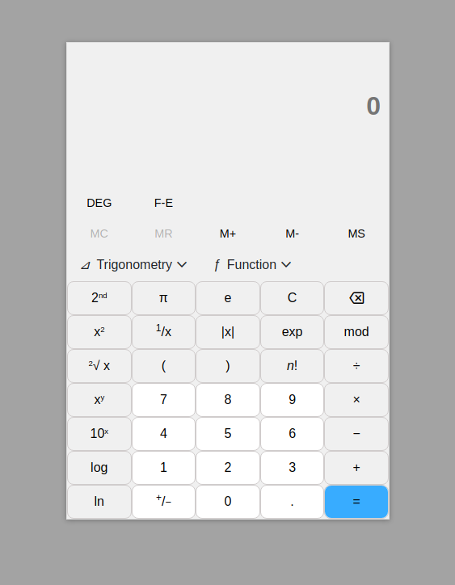
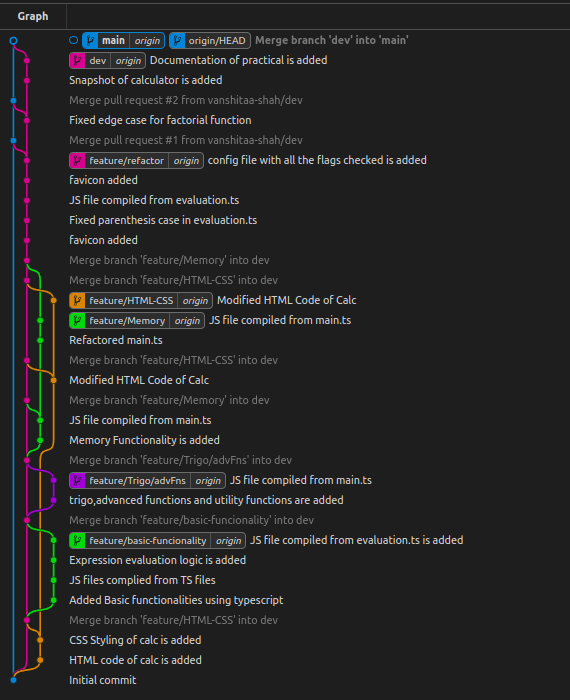

# TypeScript-Calculator

Live Link : [https://vanshitaa-shah.github.io/TypeScript-Calculator/](https://vanshitaa-shah.github.io/TypeScript-Calculator/)

## Overview :

- This calculator is build Using HTML,CSS and TypeScript(which is compiled into JS file) 
- Build without using Eval function.
- It has many features which helps you solve any equation.
- No limit on input but in case of overflow the most recent input will be shown.

## Key Features :

- Basic arithmetic operation : Addition, subtraction, multiplication,division.
- Trigonometric Functions : sine,cosine,tan and inverse of them(asin,acos,atan).Works well with both DEG RAD mode.
- Functions like : absolute,floor,ceil
- square,sqrt,cute root,power,mod,exp and many more functions are included.
- 2nd button is there, It flips the column with some more functionalities.
- F-E converts number into exponential form.
- Memory Register is used to store(MS) value and can be recalled using MR at any moment.Also we can add or subtract value from memory using (M+) and (M-).
- Factorial function gives factorial of input or equation.
- Alert, Error messages are shown on any invalid inputs.
- For solving expression, used infix to prefix method.

## Tips :

- For using (+/-) negate button , the operand must be given.
  - example: 5 then press (+/-) for -5
- For getting negation of expression inside parenthesis , the closing bracket should be completed.
  - example: (4+5) then press (+/-) for -(4+5).
- It might show Double minus (--) that represents (+).
- For using square and sqrt kind of functions give operand first.
  - example: To find cube root of 27 give operand 27 then press cbrt button so 27^(1/3) =3.
- It automatically use multiplication if no operator is specified between two functionalities.

### Folder Structure:

    .
    ├── index.html
    ├── README.md
    ├── src
    │   ├── build
    │   │   ├── evaluation.js
    │   │   └── main.js
    │   ├── CSS
    │   │   └── style.css
    │   ├── images
    │   │   └── favicon.ico
    │   └── Scripts
    │       ├── evaluation.ts
    │       └── main.ts
    └── tsconfig.json

- In src -> Scripts : All the typescript files are in this folder.
- In src -> build : All the generated compiled JS files are in this folder.
- In tsconfig.json : Target version is set to "ES2020", root directory is "./src/Scripts", out directory is "./src/build" and all the flags are opened and checked.

### WorkFlow:

